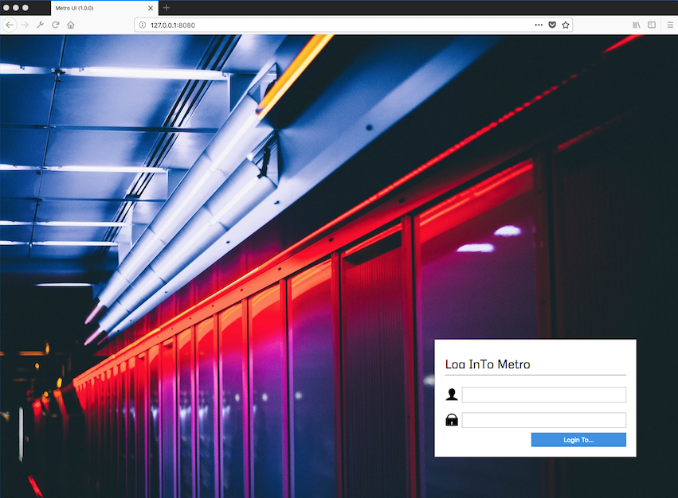
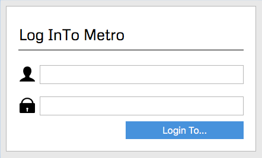
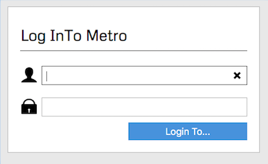
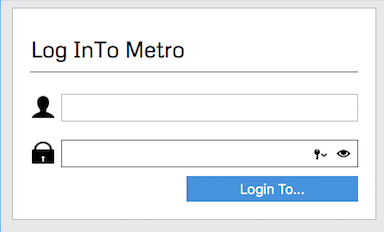
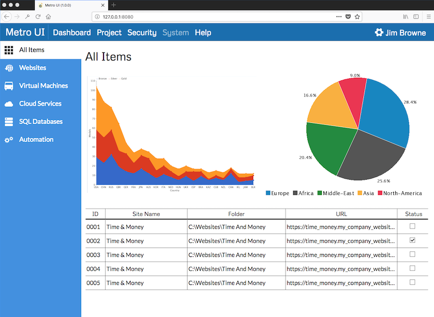
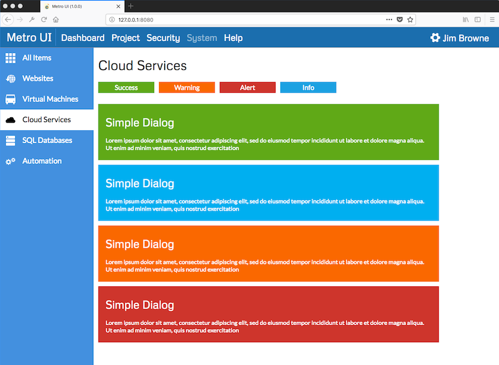
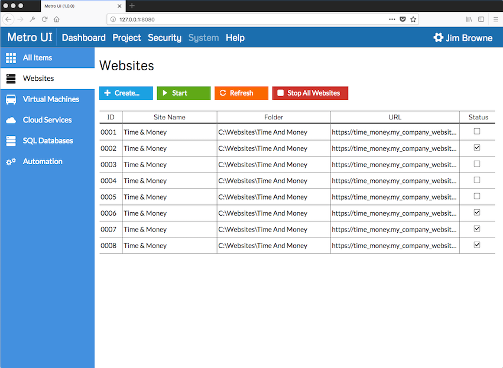
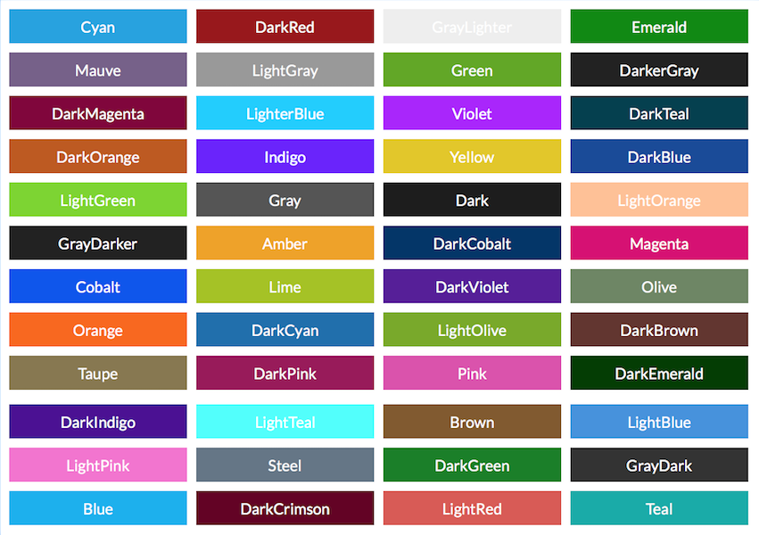
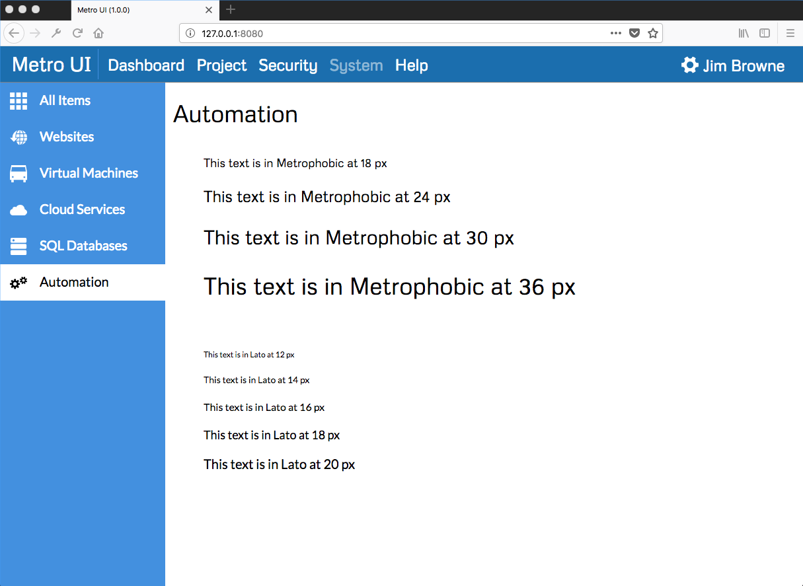

# XOJO Metro

This offering tries to demonstrate a possible way of building a Metro style UI website using XOJO (https://www.xojo.com).

### Logon Page

The logon page uses a WebImageView to display the background image, with some javascript to resize the image on the page.  So unfortunately it leaves something to be desired when the window is resized.

#### Logon Panel

Panel | Description
------------ | -------------
 | The panel provides two fields to collect the user input.  A field to enter the user id and a field to enter the password.  Plus of course a button to execute the logon action.
 | When hovering over the field the border changes from dark grey to black. When one clicks into the field a button appears on the right hand side to enable the user to clear the input field.
 | As with the user input field, when one hovers over the field the dark grey border changes to black.  When one clicks into the field a button appears to enable one to access the user passwords and another to allow one to see the entered password.

#### Main Page

### Cloud Services Page

This page demonstrates a number of message dialogs and information panels.

### Websites Page

This page demonstrates another way to format the standard WebListbox and the use of images to implement checkbox columns.

### Colors

The project contains WebStyle definitions for the common Metro colors.

### Fonts

The project makes use of the google fonts resource to obtain the Metor text look.

### Images and Icons

All of the images and icons used in this demonstration were created using Syncfunsion's Metro Studio, which is freely available and can be downloaded at:
https://www.syncfusion.com/downloads/metrostudio

